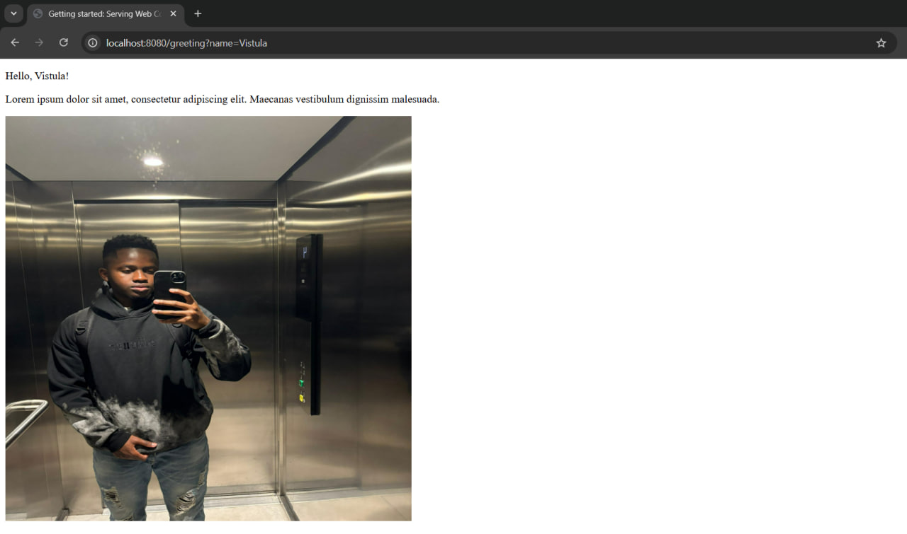

This is a fundamental backend application built with Java and Spring Boot that manages web requests. It features a controller designed to respond to a specific request with plain text, and it operates on your local machine.

To verify the application's functionality, navigate to http://localhost:8080/greeting?name=Vistula.

Here's a look at the greeting page:
